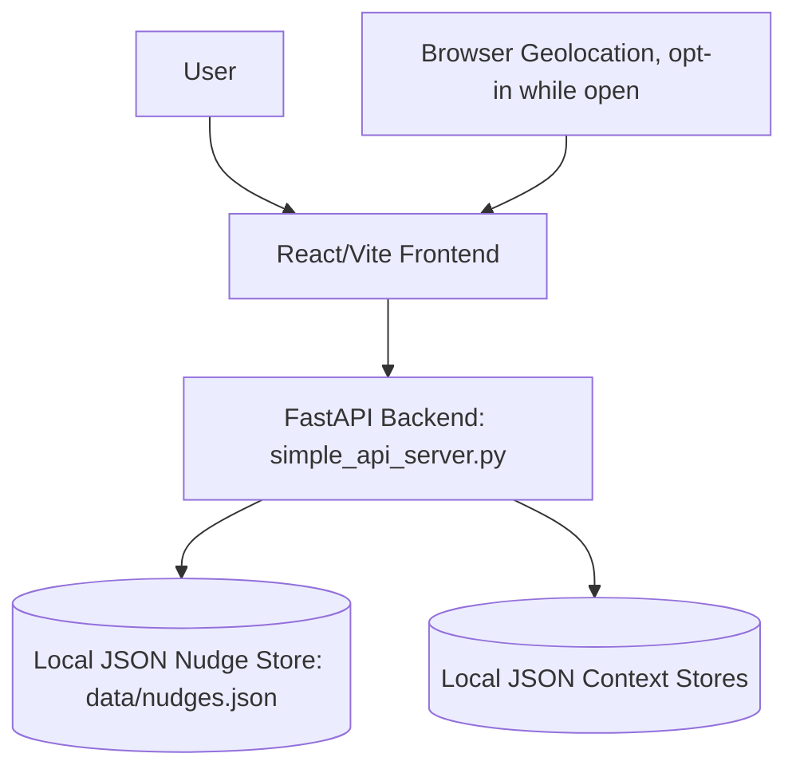
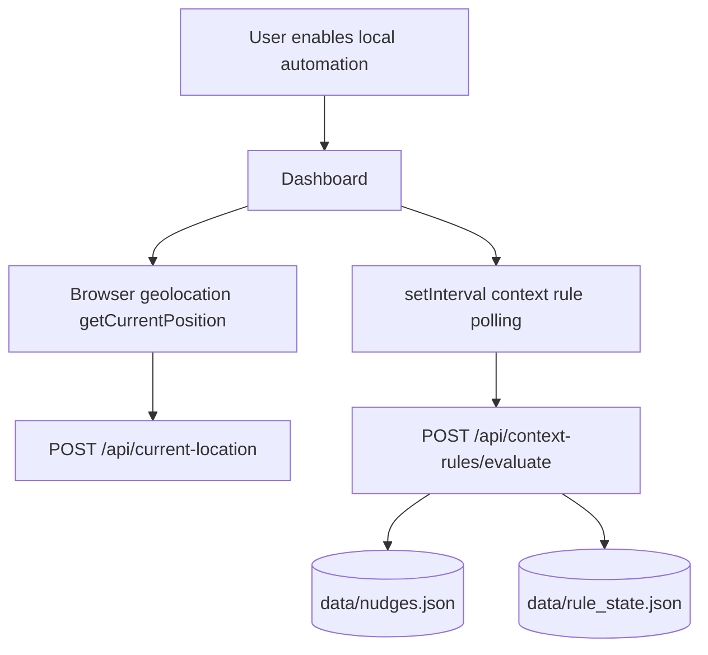
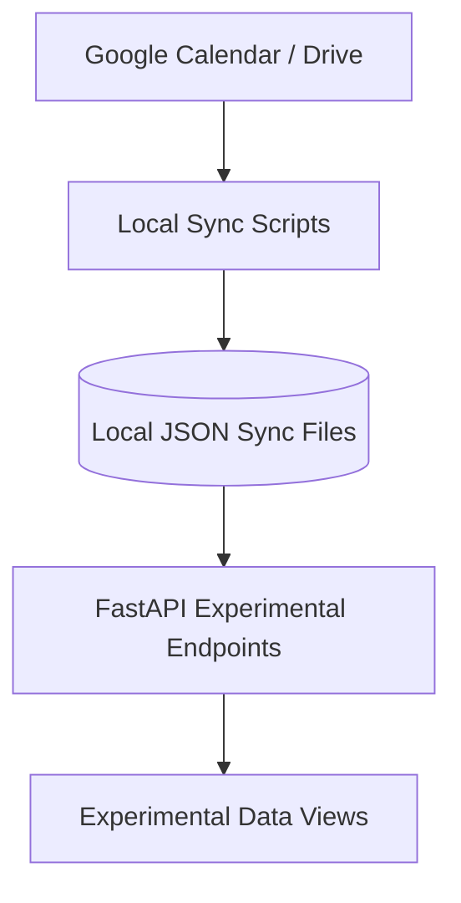
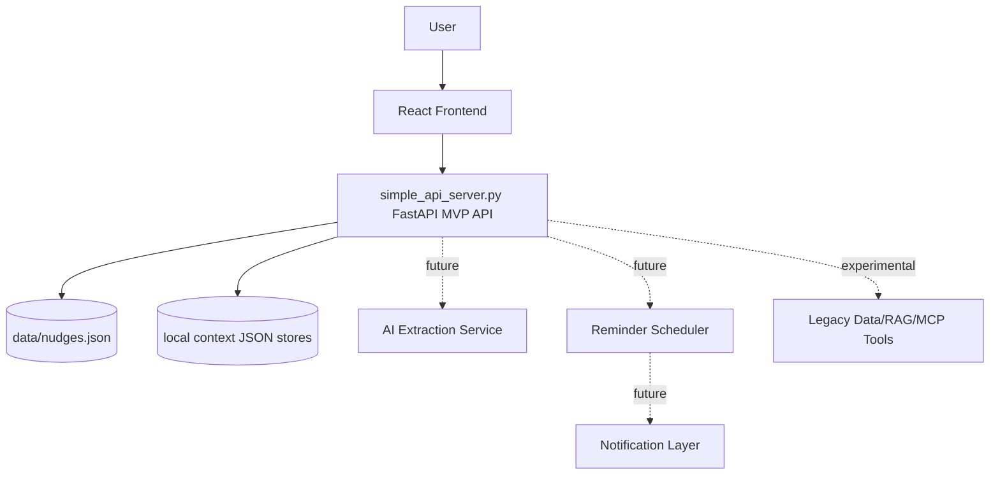

# NudgeAI Architecture

## Current Architecture

The current repo is a prototype with several overlapping runtime paths. As of the V0/V1 implementation pass, the canonical MVP runtime path is:

- React/Vite frontend in `frontend/`.
- FastAPI backend in `simple_api_server.py` on port `8001`.
- Local JSON persistence in `data/nudges.json`, `data/places.json`, `data/context_rules.json`, `data/rule_state.json`, `data/current_location.json`, and `data/calendar_availability.json`.

Legacy/experimental paths remain in the repository:

- MCP server in `mcp_server.py` with Hugging Face, WhiteCircle, RAG, and Google-data tools.
- MCP HTTP bridge in `mcp_api_bridge.py`.
- Alternative APIs in `backend_data_api.py` and `nudgeai_data_api.py`.
- Google data ingestion in `data_ingestion/`.
- RAG system in `ragsystem/` using sentence-transformers and FAISS.
- JSON files in root and `data_sync/` used as data sources or demo outputs.

The MVP now has a persisted manual nudge lifecycle and a local-first personal context loop. The dashboard can edit places/rules, fetch browser geolocation while the page is open, and poll context rules on an opt-in interval. It still has no app auth layer and is not production-ready.

## Core MVP Path



## Local Context Automation Path



Automation is client-side and disabled by default. It runs only while the dashboard is open. It does not use background mobile tracking, cloud sync, or production Google APIs.

## Experimental Google Context Path



The experimental Google context path must not be confused with production integrations. It currently serves locally synced metadata and requires stronger auth, consent, token storage, data retention controls, sanitization, and deployment hardening before production use.

## Recommended MVP Architecture



For MVP, keep RAG/MCP as optional experimental modules until the nudge loop is reliable. Do not route the core app through MCP.

## Core Entities

- User: Not implemented in MVP. Current mode is single-user local prototype; production needs a real user model.
- Nudge: Actionable reminder/task with title, context, due date, status, priority, and source.
- NudgeStatus: `pending`, `snoozed`, `completed`, `dismissed`.
- Place: Local point of interest with name, coordinates, radius, tags, and enabled state.
- ContextRule: Local rule with place, required free minutes, time window, cooldown, and nudge template.
- SourceStatus: Frontend status card payload for local Location and Calendar availability sources.
- AIExtraction: Future entity, not implemented in this MVP pass.
- Reminder: Future entity, not implemented beyond `reminderAt` and `snoozedUntil` fields.
- ActivityLog: Future entity, not implemented.

## Suggested MVP Data Model

```ts
type NudgeStatus = "pending" | "snoozed" | "completed" | "dismissed";
type NudgePriority = "low" | "medium" | "high";
type NudgeSource = "manual" | "context_rule" | "ai_note" | "calendar" | "email" | "demo";

type User = {
  id: string;
  email?: string;
  displayName?: string;
  timezone: string;
  createdAt: string;
};

type Nudge = {
  id: string;
  title: string;
  context?: string;
  dueAt?: string;
  reminderAt?: string;
  snoozedUntil?: string;
  status: NudgeStatus;
  priority: NudgePriority;
  source: "manual" | "context_rule" | "demo";
  createdAt: string;
  updatedAt: string;
  completedAt?: string;
};

type AIExtraction = {
  id: string;
  userId: string;
  inputText: string;
  model?: string;
  suggestions: Array<{
    title: string;
    context?: string;
    dueAt?: string;
    priority: NudgePriority;
    confidence: number;
    reason: string;
  }>;
  validationStatus: "valid" | "invalid" | "partial";
  createdAt: string;
};

type Reminder = {
  id: string;
  nudgeId: string;
  channel: "in_app" | "browser" | "email";
  scheduledAt: string;
  deliveredAt?: string;
  status: "scheduled" | "delivered" | "failed" | "cancelled";
};
```

## Current MVP API Surface

- `GET /health`
- `GET /api/nudges`
- `POST /api/nudges`
- `PATCH /api/nudges/{nudge_id}`
- `DELETE /api/nudges/{nudge_id}`
- `GET /api/context`
- `GET /api/source-status`
- `GET /api/places`
- `POST /api/places`
- `PATCH /api/places/{place_id}`
- `PUT /api/places/{place_id}`
- `GET /api/context-rules`
- `POST /api/context-rules`
- `PATCH /api/context-rules/{rule_id}`
- `PUT /api/context-rules/{rule_id}`
- `GET /api/current-location`
- `POST /api/current-location`
- `PATCH /api/context/location`
- `PATCH /api/context/calendar`
- `POST /api/context-rules/evaluate`
- `POST /api/context/evaluate`

Experimental data endpoints under `/api/mcp/tools/*` remain local prototype paths and are not the canonical nudge runtime.

## AI Pipeline

```text
Messy input
-> normalize
-> extract possible nudges
-> validate JSON
-> score priority
-> attach confidence and reason
-> user review
-> save nudge
-> schedule reminder
```

Recommendations:

- Use a strict JSON schema for extraction results.
- Reject or ask for user review when due dates are ambiguous.
- Store original input and extraction metadata only if privacy policy allows it.
- Keep manual nudge CRUD functional when AI keys are missing.
- Treat RAG and Google integrations as future context providers, not the MVP foundation.

## Error Handling

- API errors should return structured `{ error: { code, message, details? } }` responses.
- Frontend should show real error states instead of silently replacing failures with mock data.
- AI failures should leave the user in control with manual entry.
- Scheduler failures should mark reminders failed and surface retry actions.
- Logs should avoid full note/calendar/location contents.

## Security/Privacy Considerations

NudgeAI can handle sensitive notes, calendar events, location history, fitness data, documents, contacts, and AI prompts. Before production use:

- Add auth and user-level access control.
- Disable wildcard CORS.
- Do not commit token files, logs, or personal data.
- Validate all API inputs and AI outputs.
- Rate-limit AI endpoints.
- Document external AI provider data flow.
